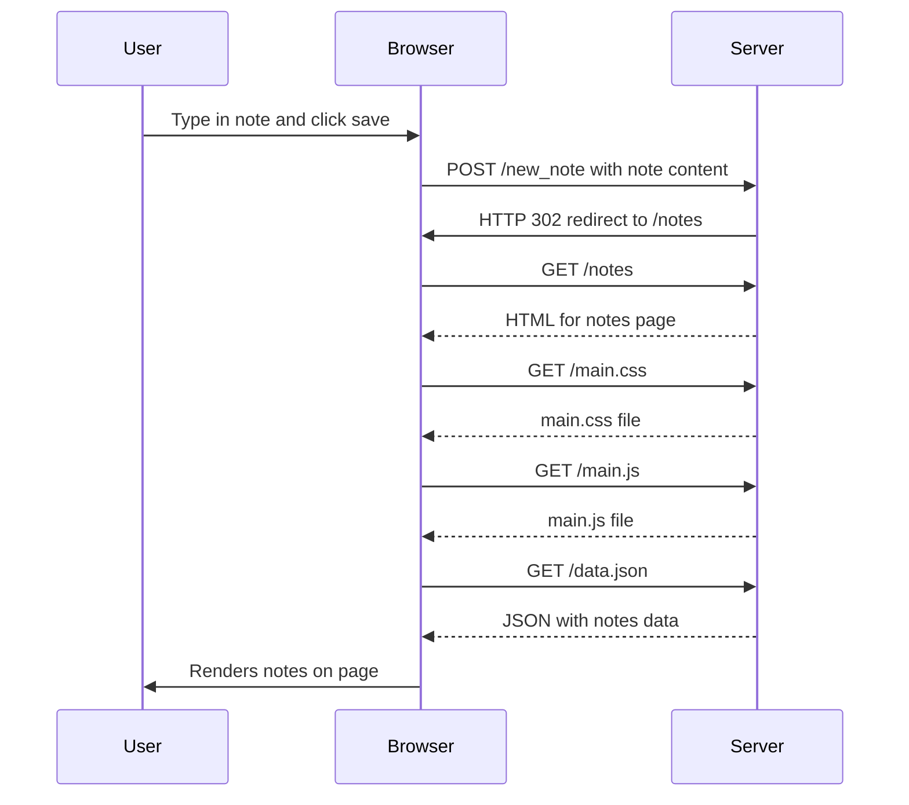

### Exercise 0.4: New Note Diagram

For the sequence of events when a user creates a new note:

```mermaid
sequenceDiagram
    participant User as User
    participant Browser as Browser
    participant Server as Server
    User->>Browser: Type in note and click save
    Browser->>Server: POST /new_note with note content
    Server->>Browser: HTTP 302 redirect to /notes
    Browser->>Server: GET /notes
    Server-->>Browser: HTML for notes page
    Browser->>Server: GET /main.css
    Server-->>Browser: main.css file
    Browser->>Server: GET /main.js
    Server-->>Browser: main.js file
    Browser->>Server: GET /data.json
    Server-->>Browser: JSON with notes data
    Browser->>User: Renders notes on page
```