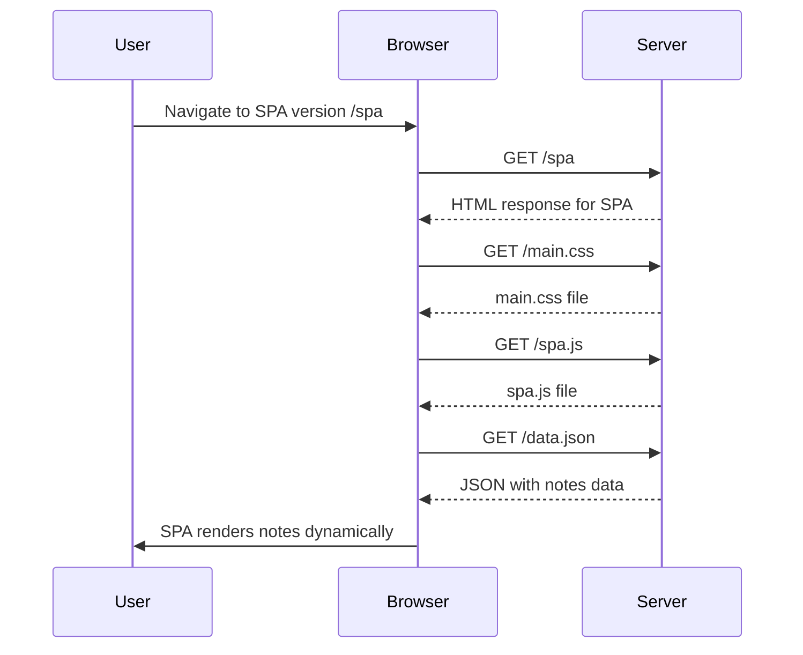

### Exercise 0.5: Single Page App Diagram

For the sequence of events when a user navigates to the SPA version of the notes app:

```mermaid
sequenceDiagram
    participant User as User
    participant Browser as Browser
    participant Server as Server
    User->>Browser: Navigate to SPA version /spa
    Browser->>Server: GET /spa
    Server-->>Browser: HTML response for SPA
    Browser->>Server: GET /main.css
    Server-->>Browser: main.css file
    Browser->>Server: GET /spa.js
    Server-->>Browser: spa.js file
    Browser->>Server: GET /data.json
    Server-->>Browser: JSON with notes data
    Browser->>User: SPA renders notes dynamically
```
    