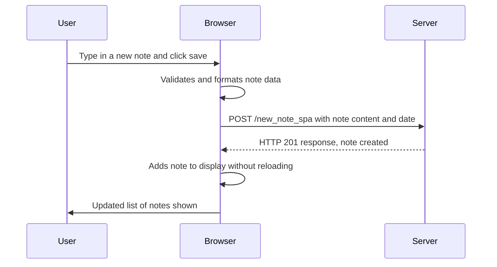

### Exercise 0.6: New Note in Single Page App Diagram

For the sequence of events when a user creates a new note in the SPA:

```mermaid
sequenceDiagram
    participant User as User
    participant Browser as Browser
    participant Server as Server
    User->>Browser: Type in a new note and click save
    Browser->>Browser: Validates and formats note data
    Browser->>Server: POST /new_note_spa with note content and date
    Server-->>Browser: HTTP 201 response, note created
    Browser->>Browser: Adds note to display without reloading
    Browser->>User: Updated list of notes shown
```